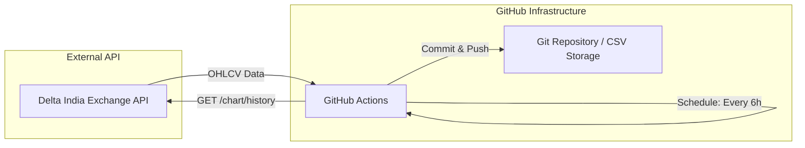

# High-Level Design (HLD)

## 1. System Architecture

The Delta India Exchange Data Pipeline is a serverless, event-driven (scheduled) architecture that leverages GitHub infrastructure for both execution and storage.

## 2. Components

### A. Scheduler (GitHub Actions)
- Triggers the pipeline based on a `cron` expression (`0 */6 * * *`).
- Provides a virtual environment (Ubuntu) to run the Python script.
- Handles authentication via GitHub Secrets.

### B. Data Processor (Python)
- Core logic for fetching product metadata and historical price candles.
- Implements incremental fetching logic to minimize bandwidth and API load.
- Handles data formatting and merging with existing datasets.

### C. Storage (Git & CSV)
- Data is stored as flat CSV files for simplicity and portability.
- Each ticker (symbol) has an individual file in `data/ohlcv/`.
- Product metadata is stored in `data/products.csv`.

## 3. Data Flow
1. **Trigger**: GitHub Action initiates the workflow.
2. **Setup**: Python environment is prepared, and dependencies are installed.
3. **Execution**: `fetch_data.py` starts.
   - Fetches active products.
   - Checks existing CSV files for the last timestamp.
   - Requests new data from Delta API starting from `last_timestamp + 1`.
4. **Persistence**: New data is appended, and files are updated.
5. **Sync**: GitHub Action commits the changes and pushes back to the `main` branch.

## 4. Security
- Sensitive information (API Keys) is never stored in code.
- Authentication is handled via encrypted **GitHub Secrets**.
